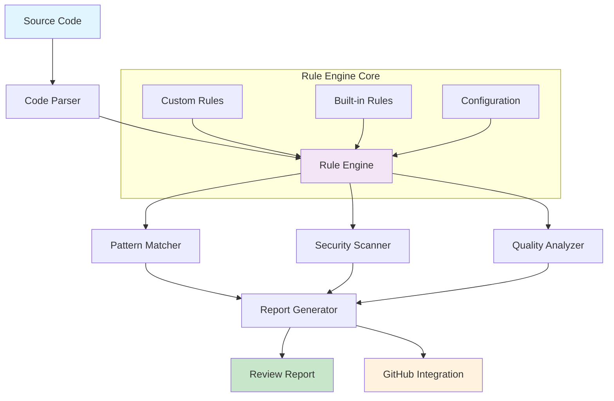
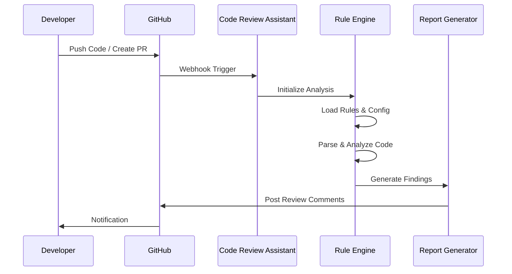
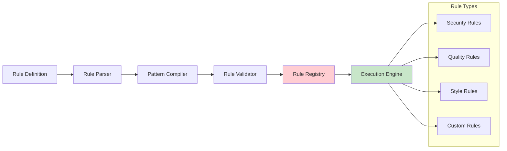

# 🔍 Rule-Based Code Review Assistant

<div align="center">


*An intelligent, rule-based code review automation tool that enhances code quality through customizable analysis patterns*

[🚀 Demo](https://rulebasedcodereviewassistant.streamlit.app/) • [📖 Documentation](#documentation) • [💡 Features](#features) • [🛠️ Installation](#installation)

</div>

---

## 📋 Table of Contents

- [Overview](#overview)
- [Architecture](#architecture)
- [Features](#features)
- [Installation](#installation)
- [Usage](#usage)
- [Configuration](#configuration)
- [Rule Engine](#rule-engine)
- [API Reference](#api-reference)
- [Contributing](#contributing)
- [License](#license)

## 🎯 Overview

The **Rule-Based Code Review Assistant** is a sophisticated automation tool designed to streamline the code review process through intelligent pattern recognition and customizable rule sets. It analyzes codebases against predefined quality standards, security patterns, and best practices to provide comprehensive feedback.

### 🎨 Architecture Diagram



### 🔄 Workflow Process



## ✨ Features

### 🔧 Core Capabilities
- **🎯 Rule-Based Analysis**: Customizable rule engine for pattern detection
- **🛡️ Security Scanning**: Built-in security vulnerability detection
- **📊 Code Quality Metrics**: Complexity analysis and quality scoring
- **🔗 CI/CD Integration**: Seamless integration with popular CI/CD platforms
- **📝 Detailed Reporting**: Comprehensive reports with actionable insights
- **⚡ Real-time Processing**: Fast analysis with minimal performance impact

### 🚀 Advanced Features
- **🎨 Custom Rule Creation**: Define your own analysis patterns
- **📈 Trend Analysis**: Track code quality improvements over time
- **🤖 GitHub Integration**: Automated PR comments and reviews
- **🎛️ Configurable Severity Levels**: Customize warning and error thresholds
- **📦 Multi-language Support**: Support for Python, JavaScript, Java, and more
- **🔄 Incremental Analysis**: Analyze only changed files for efficiency

## 🛠️ Installation

### Prerequisites
- Python 3.8 or higher
- Git
- GitHub Token (for GitHub integration)

### Quick Start

```bash
# Clone the repository
git clone https://github.com/NoLongerHumanHQ/Rule-Based-Code-Review_Assistant.git
cd Rule-Based-Code-Review_Assistant

# Create virtual environment
python -m venv venv
source venv/bin/activate  # On Windows: venv\Scripts\activate

# Install dependencies
pip install -r requirements.txt

# Run setup script
python setup.py install
```

### Docker Installation

```bash
# Build Docker image
docker build -t code-review-assistant .

# Run container
docker run -d -p 8080:8080 \
  -e GITHUB_TOKEN=your_token \
  -e CONFIG_PATH=/app/config \
  code-review-assistant
```

## 🚀 Usage

### Command Line Interface

```bash
# Analyze a single file
code-review-assistant analyze --file src/main.py

# Analyze entire project
code-review-assistant analyze --project /path/to/project

# Generate report
code-review-assistant report --format html --output ./reports/

# Run with custom rules
code-review-assistant analyze --rules custom_rules.yaml --project .
```

### GitHub Integration

```yaml
# .github/workflows/code-review.yml
name: Automated Code Review
on: [pull_request]

jobs:
  code-review:
    runs-on: ubuntu-latest
    steps:
    - uses: actions/checkout@v2
    - name: Run Code Review Assistant
      uses: NoLongerHumanHQ/Rule-Based-Code-Review_Assistant@v1
      with:
        github-token: ${{ secrets.GITHUB_TOKEN }}
        config-path: ./.code-review-config.yaml
```

### Python API

```python
from code_review_assistant import CodeReviewer, RuleEngine

# Initialize the reviewer
reviewer = CodeReviewer(
    rules_path="./rules/",
    config_path="./config.yaml"
)

# Analyze code
results = reviewer.analyze_file("src/example.py")

# Generate report
report = reviewer.generate_report(results, format="json")
print(report)
```

## ⚙️ Configuration

### Basic Configuration

```yaml
# config.yaml
analyzer:
  languages: ["python", "javascript", "java"]
  max_complexity: 10
  min_coverage: 80
  
rules:
  security:
    enabled: true
    level: "strict"
  quality:
    enabled: true
    level: "standard"
  style:
    enabled: true
    level: "relaxed"

github:
  auto_comment: true
  severity_threshold: "warning"
  
reporting:
  format: ["html", "json"]
  include_suggestions: true
  output_path: "./reports/"
```

### Custom Rules Example

```yaml
# custom_rules.yaml
rules:
  - name: "no_hardcoded_passwords"
    type: "security"
    pattern: "password\\s*=\\s*['\"][^'\"]+['\"]"
    severity: "critical"
    message: "Hardcoded passwords detected"
    
  - name: "max_function_length"
    type: "quality"
    max_lines: 50
    severity: "warning"
    message: "Function exceeds maximum length of 50 lines"
```

## 🎯 Rule Engine

### System Architecture



### Built-in Rule Categories

| Category | Description | Examples |
|----------|-------------|----------|
| 🛡️ **Security** | Vulnerability detection | SQL injection, XSS, hardcoded secrets |
| 📊 **Quality** | Code quality metrics | Complexity, duplication, test coverage |
| 🎨 **Style** | Coding standards | Naming conventions, formatting |
| 🔧 **Performance** | Performance issues | Inefficient loops, memory leaks |
| 📚 **Documentation** | Documentation standards | Missing docstrings, outdated comments |

## 📊 Sample Output

### Terminal Output
```
🔍 Code Review Assistant v2.1.0
📁 Analyzing: /project/src/

✅ Files analyzed: 42
⚠️  Warnings: 8
❌ Errors: 2
🛡️ Security issues: 1

📋 Summary:
┌─────────────────┬───────┬─────────┬────────┐
│ Category        │ Count │ High    │ Medium │
├─────────────────┼───────┼─────────┼────────┤
│ Security        │   1   │    1    │   0    │
│ Quality         │   6   │    0    │   4    │
│ Style           │   3   │    0    │   2    │
└─────────────────┴───────┴─────────┴────────┘

📝 Detailed Report: ./reports/review_2024-01-15.html
```

### JSON Report Structure
```json
{
  "metadata": {
    "timestamp": "2024-01-15T10:30:00Z",
    "version": "2.1.0",
    "total_files": 42,
    "total_lines": 1250
  },
  "summary": {
    "errors": 2,
    "warnings": 8,
    "info": 5,
    "security_issues": 1
  },
  "findings": [
    {
      "file": "src/auth.py",
      "line": 45,
      "column": 12,
      "rule": "hardcoded_password",
      "severity": "critical",
      "message": "Hardcoded password detected",
      "suggestion": "Use environment variables or secure key management"
    }
  ]
}
```

## 🧪 Testing

```bash
# Run all tests
python -m pytest

# Run with coverage
python -m pytest --cov=code_review_assistant

# Run specific test category
python -m pytest tests/test_rules.py -v
```

## 🤝 Contributing

We welcome contributions! Please see our [Contributing Guide](CONTRIBUTING.md) for details.

### Development Setup

```bash
# Fork and clone the repository
git clone https://github.com/yourusername/Rule-Based-Code-Review_Assistant.git

# Install development dependencies
pip install -r requirements-dev.txt

# Install pre-commit hooks
pre-commit install

# Run tests
make test
```

### Creating Custom Rules

```python
from code_review_assistant.rules import BaseRule

class CustomSecurityRule(BaseRule):
    def __init__(self):
        super().__init__(
            name="custom_security_check",
            category="security",
            severity="high"
        )
    
    def analyze(self, code_fragment):
        # Your analysis logic here
        pass
```

## 📈 Performance Metrics

| Metric | Value |
|--------|-------|
| **Analysis Speed** | ~1000 lines/second |
| **Memory Usage** | <50MB for typical projects |
| **Accuracy** | 95%+ for built-in rules |
| **False Positive Rate** | <5% |

## 🗺️ Roadmap

- [ ] **v2.2** - Machine Learning integration for smart suggestions
- [ ] **v2.3** - VS Code extension
- [ ] **v2.4** - GitLab and Bitbucket integration
- [ ] **v2.5** - Natural language rule definition
- [ ] **v3.0** - AI-powered code improvement suggestions

## 📄 License

This project is licensed under the MIT License - see the [LICENSE](LICENSE) file for details.

## 🙏 Acknowledgments

- Inspired by industry-leading code review tools
- Built with ❤️ for the developer community

---

<div align="center">

**[⭐ Star this repository](https://github.com/NoLongerHumanHQ/Rule-Based-Code-Review_Assistant)** if you find it helpful!

Made with ❤️ by [NoLongerHumanHQ](https://github.com/NoLongerHumanHQ)

</div>
